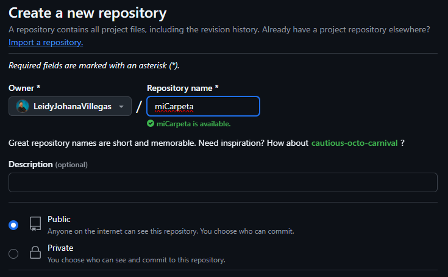
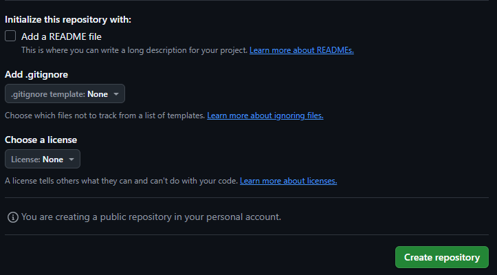

# Entrega de conocimiento usando GitHub con repositorio local y repositorio GitHub:
``` 
1. Crear Repositorio local desde la terminal.
RTA: Aquí creamos la carpeta.
 ´´´Microsoft Windows [Versión 10.0.26100.3775]
    (c) Microsoft Corporation. Todos los derechos reservados.
    C:\Users\JOHANA NIÑO>cd desktop
    C:\Users\JOHANA NIÑO\Desktop>mkdir miCarpeta´´´
2. Aquí observamos la carpeta creada
 ´´´C:\Users\JOHANA NIÑO\Desktop>dir
     El volumen de la unidad C es Windows
     El número de serie del volumen es: 46F9-982D
   Directorio de C:\Users\JOHANA NIÑO\Desktop
    04/20/2025  10:41 PM    <DIR>          miCarpeta´´´
3. Y aquí ingresamos al visual  studio code desde la terminal.
 ´´´C:\Users\JOHANA NIÑO\Desktop>cd miCarpeta
    C:\Users\JOHANA NIÑO\Desktop\miCarpeta>code .´´´
4. Crear repositorio GitHub.
    RTA:
 ´´´´´´
 ´´´´´´
5. Aquí creo el README.md, inicializo y guardo .
 ´´´PS C:\Users\JOHANA NIÑO\Desktop\miCarpeta> echo "# Entrega de conocimiento usando GitHub con repositorio local y repositorio GitHub" >> README.md
    PS C:\Users\JOHANA NIÑO\Desktop\miCarpeta> git init
    Initialized empty Git repository in C:/Users/JOHANA NIÑO/Desktop/miCarpeta/.git/
    PS C:\Users\JOHANA NIÑO\Desktop\miCarpeta> git add README.md´´´
6. Crear el primer commit desde la terminal de visual y enlazar repositorios.
RTA:
 ´´´PS C:\Users\JOHANA NIÑO\Desktop\miCarpeta> git commit -m "first commit"
    [master (root-commit) a708f61] first commit
     1 file changed, 1 insertion(+)
     create mode 100644 README.md´´´
7. Aquí renombro la rama principal.
 ´´´PS C:\Users\JOHANA NIÑO\Desktop\miCarpeta> git branch -M main´´´
8. Aquí enlazo el repositorio remoto al local.
 ´´´PS C:\Users\JOHANA NIÑO\Desktop\miCarpeta> git remote add origin https://github.com/LeidyJohanaVillegas/miCarpeta.git
   main
    Enumerating objects: 3, done.
    Counting objects: 100% (3/3), done.
    Delta compression using up to 12 threads
    Compressing objects: 100% (2/2), done.
    Writing objects: 100% (3/3), 288 bytes | 144.00 KiB/s, done.
    Total 3 (delta 0), reused 0 (delta 0), pack-reused 0 (from 0)
    To https://github.com/LeidyJohanaVillegas/miCarpeta.git
     * [new branch]      main -> main
    branch 'main' set up to track 'origin/main'.´´´
  9. Aquí realizo un push.
 ´´´PS C:\Users\JOHANA NIÑO\Desktop\miCarpeta> git push -u origin main
    branch 'main' set up to track 'origin/main'.
    Everything up-to-date´´´
``` 
